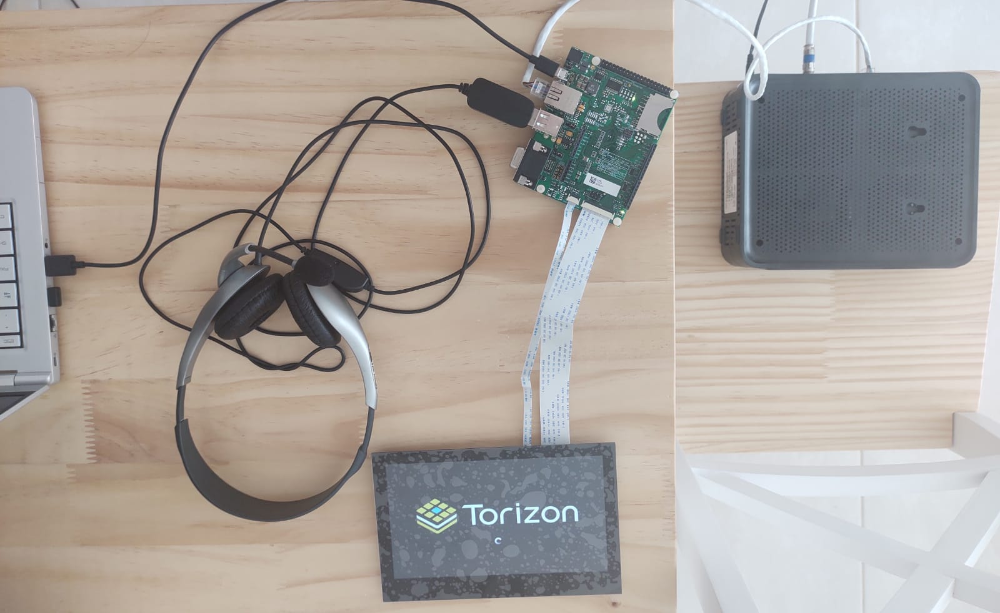
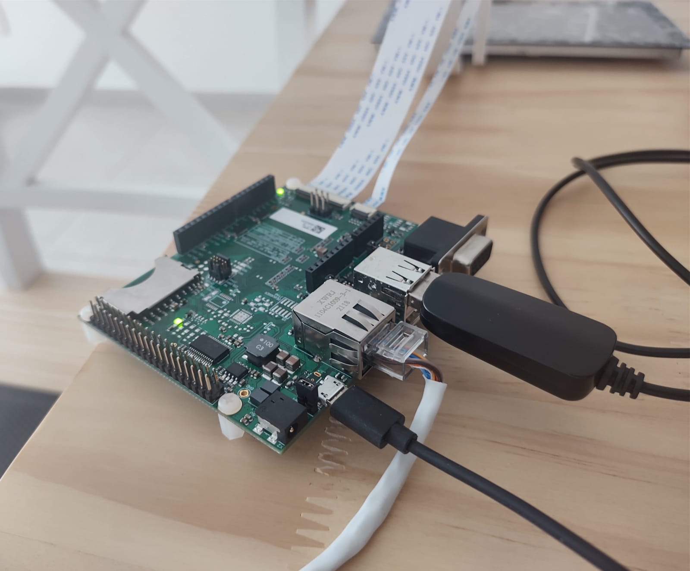
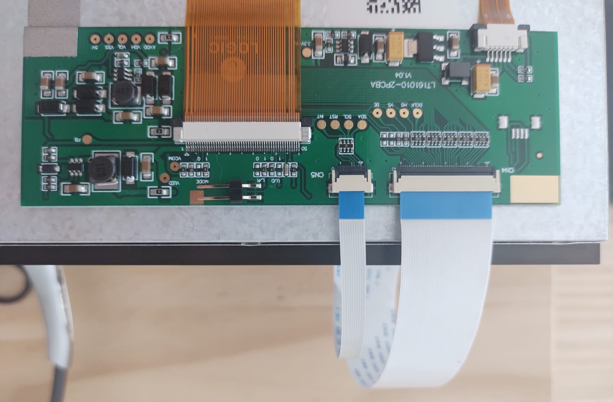

# Projeto de Conclusão da Disciplina SAA0356 - Sistemas Embarcados para Veículos Aéreos - Tradutor por Voz

---
>#### :warning: ATENÇÃO
>**Este é um projeto pessoal e que não faz parte de nenhuma iniciativa da Toradex.**
---

Este projeto consiste de um tradutor por voz implementado em um sistema embarcado, usando como dispositivos uma placa base Aster V1.1 e um módulo Colibri iMX8X, ambos da marca [Toradex](https://www.toradex.com/pt-br/ "Toradex").

## Motivação

Desde criança tenho o fascínio por aprender sobre países e assuntos gerais de geografia. Quando tinha 4 anos de idade, tinha o costume de memorizar as bandeiras dos países, e mais tarde comecei a aprender novos idiomas. Dessa forma, decidi seguir adiante com o projeto trazendo este assunto que tanto gosto e que me acompanha até os dias atuais.

>#### :memo: INFO
>O projeto foi desenvolvido utilizando uma das distribuições do Linux baseadas no Debian. Neste caso, utilizo o Ubuntu versão 22.04. Também é importante mencionar que uso Python versão 3.10.6 e que tenho pré-instalado o gerenciador de pacotes PIP versão 22.0.2.

---

>#### :memo: INFO
>Ao longo deste arquivo, quando descritos os comandos no terminal do Linux, haverá símbolos indicando onde eles serão executados, isto é, o sifrão (**$**) indica que o comando é executado na máquina *host* (o computador que utiliza), a cerquilha simples (**#**) indica que o comando é executado no dispositivo embarcado, e a cerquilha dupla (**##**) indica que o comando é executado dentro de um container no dispositivo embarcado. Para mais informações, [acesse o site da Toradex sobre as convenções tipográficas](https://developer.toradex.com/software/toradex-embedded-software/typographic-conventions-for-the-toradex-documentation/ "Typographic Conventions for the Toradex Documentation") aqui utilizadas. 

---

>## 1ª Etapa: Como usar a Transcrição de Áudio com Python

### 1\. Instalando as bibliotecas

Em primeiro momento, é necessário instalar algumas bibliotecas para desenvolver o código de transcrição de áudio. Assim, em um terminal, digite:

|$|**pip install SpeechRecognition**|
|:----:|:----|

Essa biblioteca tem a função de reconhecer a fala do usuário em determinado idioma. Para mais informações, acesse: [SpeechRecognition](https://pypi.org/project/SpeechRecognition/ "SpeechRecognition").

>#### :warning: ATENÇÃO
>Se estiver usando uma distribuição do Linux baseada no Debian, é possível encontrar um erro se estiver utilizando uma versão do Python superior a 3.6 ao fazer o download da biblioteca "PyAudio". Isso provavelmente acontece porque as ferramentas necessárias estão indisponíveis para configurar a biblioteca. Assim, para resolver o problema, digite o seguinte no terminal: 

|$|**sudo apt install portaudio19-dev python3-pyaudio**|
|:----:|:----|

Agora, provavelmente será possível instalar a biblioteca "PyAudio":

|$|**pip install PyAudio**|
|:----:|:----|

Fonte: [PyAudio Build Error](https://www.youtube.com/watch?v=kGf0awT4rog "PyAudio Build Error")
Para mais informações sobre a biblioteca: [PyAudio](https://pypi.org/project/PyAudio/ "PyAudio").

### 2\. Implementando o Código

O código a seguir foi retirado do site: [Accessibility and Voice Recognition with PyAudio + Speech Recognition](https://www.youtube.com/watch?v=XmjY-cFbcqw "Accessibility and Voice Recognition"). No entanto, foi um pouco modificado, pois não estava funcionando apenas com o que foi fornecido pelo site. Assim, em um novo arquivo no IDE que utiliza (eu utilizo o VS Code), digite: 

    import speech_recognition as sr

    #Definindo a função para ouvir o usuário e obter o que a pessoa disse
    def ouvindo():
        #Configurando o microfone do usuário
        mic = sr.Microphone()
        recg = sr.Recognizer()
        #Usando o microfone
        with mic as source:
            #Controlando ruídos do ambiente
            recg.adjust_for_ambient_noise(source)
            #Definindo uma flag para sinalizar ao usuário que comece a falar
            print("Diga algo: ")
            #Armazenando o que foi dito na variável "audio"
            audio = recg.listen(source)

        #A partir deste momento, o código tentará interpretar o áudio
        try:
            #Enviando o áudio para que o algorítimo reconheça os padrões de voz em português do Brasil
            frase = recg.recognize_google(audio, language='pt-BR')
            #Então, o código mostra o que o usuário disse
            print("Você disse: " + frase)

        #Se houver algum erro ao captar o áudio, o código alerta sobre
        except sr.Unknwon.Value.Error:
            print("Não entendi.")

        #Retorna a variável com a transcrição para uso futuro
        return frase

    #Usando a função criada anteriormente
    ouvindo()

>#### :memo: INFO
>Na linha 20, o parâmetro *language='pt-BR'* indica o idioma no qual o algorítimo reconhece os padrões de voz. No caso, está configurado para português do Brasil. No entanto, se deseja um outro idioma, mude *pt-BR* para a legenda dessa língua de acordo com o link a seguir: [Language support  |  Cloud Speech-to-Text Documentation  |  Google Cloud](https://cloud.google.com/speech-to-text/docs/languages "Cloud Speech-to-Text Documentation"). Não esqueça de colocar aspas simples ao redor da legenda da língua!

---

>## 2ª Etapa: Como Reproduzir a Fala do Usuário em Python

### 1\. Instalando as Bibliotecas

Para esta etapa, serão necessárias as seguintes bibliotecas. Em um terminal, digite:

|$|**pip install --user gTTS**|
|:----:|:----|

Essa é a biblioteca *Google Text-to-Speech*, que faz interface com a API do Google Tradutor. Para mais informações, acesse: [gTTS](https://pypi.org/project/gTTS/ "gTTS").

|$|**pip install --user playsound**|
|:----:|:----|

Esta biblioteca é responsável por reproduzir o áudio. Mais detalhes em [playsound](https://pypi.org/project/playsound/ "playsound").

#### 2\. Implementando o Código

Considerando que esse código será adicionado ao anterior, não há a necessidade de importar mais uma vez a biblioteca "SpeechRecognition". Assim, continuando o programa e adicionando as novas bibliotecas: 

    import speech_recognition as sr
    from gtts import gTTS
    from playsound import playsound

    #1ª Parte do código
    #_____________________________________________________________________________

    #Definindo a função para ouvir o usuário e obter o que a pessoa disse
    def ouvindo():
        #Configurando o microfone do usuário
        mic = sr.Microphone()
        recg = sr.Recognizer()
        #Usando o microfone
        with mic as source:
            #Controlando ruídos do ambiente
            recg.adjust_for_ambient_noise(source)
            #Definindo uma flag para sinalizar ao usuário que comece a falar
            print("Diga algo: ")
            #Armazenando o que foi dito na variável "audio"
            audio = recg.listen(source)

        #A partir deste momento, o código tentará interpretar o áudio
        try:
            #Enviando o áudio para que o algorítimo reconheça os padrões de voz em português do Brasil
            frase = recg.recognize_google(audio, language='pt-BR')
            #Então, o código mostra o que o usuário disse
            print("Você disse: " + frase)

        #Se houver algum erro ao captar o áudio, o código alerta sobre
        except sr.Unknwon.Value.Error:
            print("Não entendi.")

        #Retorna a variável com a transcrição para uso futuro
        return frase
    #_____________________________________________________________________________

    #2ª Parte do código 
    #_____________________________________________________________________________

    #Definindo uma função para obter a fala por escrito do usuário e reproduzi-la através da voz do Google Tradutor
    def reproduzindo(fala_por_escrito):
        #Enviando o conteúdo da variável "fala_por_escrito" para o Google Tradutor
        tts = gTTS(fala_por_escrito,lang='pt-BR')

        #Salvando o arquivo de áudio como "audio.mp3"
        tts.save('audio.mp3')
        #Definindo uma flag para sinalizar ao usuário que o computador começará a falar
        print("Estou aprendendo o que disse...")
        #Reproduzindo o áudio
        playsound('audio.mp3')

    #Armazenando a fala por escrito de acordo com a função "ouvindo"
    fala = ouvindo()
    #Reproduzindo a fala por escrito através da função "reproduzindo"
    reproduzindo(fala)
    #_____________________________________________________________________________

Dessa forma, através do código acima, foi possível:

* Dizer uma frase na língua predeterminada;
* Ler o que foi dito;
* Ouvir o que foi dito na língua predeterminada através da voz do Google Tradutor.

>#### :warning: ATENÇÃO
>Até o momento, só é possível ouvir claramente o que foi dito na mesma língua predeterminada na linha 25. Se configurada outra língua, por exemplo, inglês na linha 43 (isto é, `lang='en'`), será possível ouvir o que foi dito em português do Brasil com a voz do Google Tradutor em inglês. Assim, ainda não é possível traduzir o que foi dito em outro idioma.

>#### :memo: INFO
>O código discutido foi retirado do site seguinte: [Speech Recognition with Python | Let's Code](https://letscode.com.br/blog/speech-recognition-com-python "Speech Recognition with Python | Let's Code").

---

>## 3ª Etapa: Traduzindo a Fala do Usuário em Python

### 1\. Instalando a Biblioteca

Para esta etapa será necessário fazer o download da biblioteca `googletrans`, que usa a API do Google Tradutor para traduzir qualquer texto em determinada língua. Com a intenção de corrigir um erro, em um novo terminal instale a seguinte versão:

|$|**pip install googletrans==3.1.0a0**|
|:----:|:----|

Mais informações em [googletrans](https://pypi.org/project/googletrans/ "googletrans")

#### 2\. Implementando o Código

Neste momento, serão adicionadas novas funções ao código anterior. A partir de então, será possível:

* Dizer em português o idioma no qual deseja-se falar;
* Dizer uma frase na língua desejada;
* Ler o que foi dito;
* Dizer em português o idioma no qual a frase dita será traduzida;
* Ouvir a tradução através da voz do Google Tradutor na língua desejada.

Para acessar o código:

---
>[Traduzindo a Fala do Usuário em Python](/Traduzindo%20a%20Fala%20do%20Usuário%20em%20Python.py/)
---

>#### :memo: INFO
>As novas funcionalidades adicionadas ao código foram baseadas no código do link a seguir: [Create a Real Time Voice Translator using Python](https://www.geeksforgeeks.org/create-a-real-time-voice-translator-using-python/ "Create a Real Time Voice Translator using Python")

---

>## 4ª Etapa: Configurando o Equipamento e o Ambiente de Desenvolvimento

Para esta etapa, usei o seguinte:

* Placa Base: Aster V1.1 [Aster Carrier Board | Toradex Developer Center](https://developer.toradex.com/hardware/colibri-som-family/carrier-boards/aster-carrier-board/#aster-carrier-board-v11 "Aster Carrier Board | Toradex Developer Center");
* Módulo: Colibri iMX8X [Colibri iMX8X | Toradex Developer Center](https://developer.toradex.com/hardware/colibri-som-family/modules/colibri-imx8x/ "Colibri iMX8X | Toradex Developer Center");
* Tela para a Interface Gráfica: Capacitive Touch Display 7" Parallel [Capacitive Touch Display 7" Parallel | Toradex Developer Center](https://developer.toradex.com/hardware/accessories/displays/capacitive-touch-display-7inch-parallel/ 'Capacitive Touch Display 7" Parallel | Toradex Developer Center');
* Cabo Ethernet;
* Cabo USB de Energia para ligar o Módulo ao computador;
* Fone de Ouvido USB.

Dessa forma, para a implementação da interface gráfica, usei a biblioteca "PySide2" do Qt, que fornece ferramentas gráficas interessantes e é compatível com o equipamento da Toradex. Para mais informações sobre como usá-la, veja [PySide2.QtWidgets — Qt for Python](https://doc.qt.io/qtforpython-5/PySide2/QtWidgets/index.html "PySide2.QtWidgets — Qt for Python").

### 1\. Montando o Equipamento Toradex

Para montar o equipamento, veja as fotos:

>#### :warning: ATENÇÃO
>Vale lembrar que é necessário ter instalado no módulo o Toradex Easy Installer. Caso não tenha feito, será preciso executar o [Modo de Recuperação](https://developer.toradex.com/hardware/hardware-resources/recovery-mode/imx-recovery-mode/#colibriimx8x "Modo de Recuperação - Recovery Mode") e então instalar o [Easy Installer](https://developer.toradex.com/easy-installer/toradex-easy-installer/loading-toradex-easy-installer/ "Toradex Easy Installer").

>Além disso, depois de fazer o procedimento acima citado, é interessante desabilitar o container do Portainer que aparece toda vez que ligar o módulo, uma vez que não será necessário para esse projeto. Assim, em um terminal, acesse o módulo:

|$|**sudo ssh torizon@<nome_do_módulo>-<modelo_do_módulo>-<número_serial>.local**|
|:----:|:----|

>No meu caso, o comando é `sudo ssh torizon@colibri-imx8x-07202901.local`. O número serial do módulo está contido no adesivo de identifacação do equipamento. Como é o primeiro acesso depois de executar o Modo de Recuperação, será necessário configurar uma nova senha. A senha padrão é `torizon`. Use-a quando solicitada para configurar uma nova senha. Depois de configurada a nova senha, será preciso acessar novamente o módulo pelo comando `ssh` mencionado, digitando primeiramente a senha de acesso do perfil do seu computador e depois a do módulo. Logo depois, após acessar o módulo, digite:

|#|**sudo systemctl stop docker-compose**|
|:----:|:----|

E então:

|#|**sudo systemctl disable docker-compose**|
|:----:|:----|

### 2\. Aprendendo a usar Qt

Para os primeiros passos sobre como implementar uma interface gráfica usando Qt, me baseei no seguinte vídeo: [Interfaces gráficas com QT e PySide](https://www.youtube.com/watch?v=5S2paeDKTLk "Interfaces gráficas com QT e PySide"). Basicamente, o vídeo apresenta como configurar um *widget* para dar suporte a uma janela de apresentação, e também outras ferramentas como configurar *labels* e botões. A partir desse ponto, procurei por outras funcionalidades na documentação do Qt, e também em fóruns online e outros vídeos.

Além disso, para utilizar o PySide2, será necessário instalá-lo:

|$|**pip3 install pyside2**|
|:----:|:----|

### 3\. Instalando o Docker Engine

O Docker Engine é uma tecnologia de conteinerização de código aberto para construir e conteinerizar aplicações. Para mais informações, acesse: [Docker Engine Overview](https://docs.docker.com/engine/ "Docker Engine Overview"). Para instalá-lo, siga os passos do link a seguir: [Install Docker Engine on Ubuntu](https://docs.docker.com/engine/install/ubuntu/ "Install Docker Engine on Ubuntu"). 

### 4\. Preparando o Ambiente de Desenvolvimento para o Torizon

Depois de instalar o Docker Engine e criar uma conta no [Docker Hub](https://hub.docker.com/ "Docker Hub"), siga os passos do [Quickstart da Toradex](https://developer-archives.toradex.com/getting-started/module-2-first-steps-with-torizon/verifying-docker-in-your-pc?som=colibri-imx8x&board=aster-carrier-board&os=torizon&desktop=linux#Step_3 "Quickstart da Toradex") a partir do passo 3 para habilitar a emulação Arm no computador.

### 5\. Instalando a libssl1.1 (apenas para usuários do Ubuntu 22.04)

Caso utilize o Ubuntu versão 22.04 como eu, será necessário instalar a *libssl1.1* de acordo com o quadro *DANGER* na seção de pré-requisitos do [site da Toradex](https://developer.toradex.com/torizon/application-development/ide-extension/visual-studio-code-extension-for-torizon/#prerequisites "Instalar libssl1.1")

### 6\. Instalando a Extensão Python no Visual Studio Code

Para que o programa funcione, é necessário ter a extensão Python instalada no VS Code. Assim, siga os passos a seguir:

1\. Na barra lateral esquerda do VS Code, procure pelo símbolo com quatro quadrados ("Extensions") e digite "python" na barra de busca;

2\. Selecione a opção "Python" da Microsoft e depois em "Install".

### 7\. Instalando a Extensão do TorizonCore no Visual Studio Code

O TorizonCore é uma plataforma de software da Toradex que faz o intercâmbio das aplicações com o hardware utilizado. Para mais informações, acesse: [TorizonCore](https://www.toradex.com/pt-br/operating-systems/torizon-core#:~:text=Plataforma%20de%20Software%20Linux%20Industrial,a%20manuten%C3%A7%C3%A3o%20dos%20seus%20dispositivos. "TorizonCore"). Será necessário instalar sua extensão no Visual Studio Code através dos passos a seguir:

1\. Na barra lateral esquerda do VS Code, procure pelo **símbolo com quatro quadrados** ("Extensions") e digite **"torizon"** na barra de busca;

2\. Selecione a opção **"Toradex Torizon Support"** e depois em **"Install"**.

### 8\. Adicionando um Novo Dispositivo à Extensão

Para adicionar um novo dispositivo, será necessário o número serial do módulo contido no adesivo de identifacação do equipamento. Assim, siga os passos seguintes:

1\. Na barra lateral do VS Code, clique no **ícone do Torizon** e passe o mouse sobre **"DEVICES"**, clicando então no símbolo **"+"** para adicionar um novo dispositivo;

2\. No canto inferior direito da tela, uma janela se abrirá perguntando como deseja que o dispositivo seja detectado. Escolha **"Network"**;

3\. Na barra superior de digitação que abrir, digite na seguinte ordem: **\<nome_do_módulo\>-\<modelo_do_módulo\>-\<número_serial\>.local**. No meu caso, será: ***colibri-imx8x-07202901.local***. Pressione Enter;

4\. Na barra de digitação aparecerá escrito **"torizon"**. Mantenha e pressione Enter. Logo depois, será preciso digitar a senha configurada na primeira vez que acessou o dispositivo pelo terminal. Para acessar o dispositivo pelo terminal pela primeira vez, siga os passos descritos [neste bloco de "ATENÇÃO"](https://github.com/PauloTavernaro/Projeto---Tradutor-por-Voz#warning-aten%C3%A7%C3%A3o-3). Depois de alguns minutos o dispositivo estará configurado.

### 9\. Criando um Novo Projeto de Aplicação com Qt para Python 

Para criar um novo projeto de aplicação com Qt para Python, siga os passos a seguir:

1\. Pressione **"F1"** e digite **"Torizon/Python: Create Python application"** na barra superior que abrir;

2\. Adicione um nome para o projeto;

3\. Selecione **"Qt for Python using QML"**;

4\. Selecione a arquitetura do módulo. Neste caso, será **"Python 3 arm64v8 bullseye"**;

5\. Tenha certeza de que aparecerá escrito **"torizon"** e pressione Enter.

>## 5ª Etapa: Implementando o Código no Módulo Colibri iMX8X

### 1\. Configurando Drivers Gráficos

Com o intuito de executar os drivers gráficos, é necessário configurar um arquivo "docker-compose" no projeto. Para isso, clique no **símbolo de papéis** ("Explorer") na barra lateral à esquerda e crie um novo arquivo na pasta `appconfig_0` chamado `docker-compose.yml`.

Então, copie e cole o seguinte código no arquivo criado:

    version: "2.4"
    services:
    weston:
    image: torizon/weston-vivante:2
    # EULA required to run imx8 vivante graphic drivers
    # Pre-accept as we ask the user accept the EULA already.
    environment:
      - ACCEPT_FSL_EULA=1
      - ENABLE_VNC=1
    # Required to get udev events from host udevd via netlink
    network_mode: host
    volumes:
      - type: bind
        source: /tmp
        target: /tmp
      - type: bind
        source: /dev
        target: /dev
      - type: bind
        source: /run/udev
        target: /run/udev
    cap_add:
      - CAP_SYS_TTY_CONFIG
    # Add device access rights through cgroup...
    device_cgroup_rules:
      # ... for tty0
      - 'c 4:0 rmw'
      # ... for tty7
      - 'c 4:7 rmw'
      # ... for /dev/input devices
      - 'c 13:* rmw'
      # ... for /dev/dri devices
      - 'c 226:* rmw'
      # ... for /dev/galcore device
      - 'c 199:* rmw'

>#### :memo: INFO
>É interessante mencionar que o comando `- ENABLE_VNC=1` na linha 9 habilita a visualização da tela do módulo na tela do computador através do software “Remote Desktop Viewer“. Para mais informações, acesse: [Remote Access the TorizonCore GUI Using VNC or RDP | Toradex Developer Center](https://developer.toradex.com/torizon/how-to/gui/remote-access-the-torizoncore-gui-using-vnc-or-rdp/#how-to-enable-the-vnc-and-rdp-backend-from-the-command-line "Remote Access the TorizonCore GUI Using VNC or RDP | Toradex Developer Center"). 

### 2\. Inserindo as Bibliotecas no Módulo

Como estava programando por compilação nativa antes de transplantar o código para o módulo, as bibliotecas utilizadas estavam instaladas apenas no computador. Assim, será necessário inserir as bibliotecas no módulo da seguinte forma:

1\. Clique no **ícone do Torizon** e procure por `devpackages` na seção **"CONFIGURATIONS"**. Assim, clique no **ícone de lápis** e adicione o seguinte: `libasound2-dev:#%platform.debian-arch%#`;

2\. Ainda no **ícone do Torizon**, procure por `extrapackages` na seção **"CONFIGURATIONS"**. Assim, clique no **ícone de lápis** e adicione o seguinte: `libasound2 alsa-utils python3-pyaudio python3-gi flac libespeak1`;

3\. Clique no **ícone de papéis** ("Explorer") e procure pelo arquivo `requirements.txt`. Assim, copie o código abaixo e salve no arquivo: 

    SpeechRecognition
    gTTS
    playsound
    googletrans==3.1.0a0

Vale lembrar que as bibliotecas que foram adicionadas além das que foram mencionadas servem para configurar a saída de áudio através do módulo.

### 3\. Outras Configurações

1\. No **ícone do Torizon**, procure por `[] devices` na seção **"CONFIGURATIONS"**. Assim, clique no ícone **"+"** e adicione o seguinte: `/dev/snd`;

2\. No **ícone do Torizon**, procure por `dockercomposefile` na seção **"CONFIGURATIONS"**. Assim, clique no **ícone de lápis** e adicione o nome do arquivo docker-compose criado. Neste caso foi: `docker-compose.yml`.

3\. Em um **terminal conectado ao módulo**, digite `cat /proc/asound/cards`. Veja qual o número do cartão relacionado ao fone de ouvido com microfone. Logo em seguida, digite `cd /etc`, pressione Enter, e digite `sudo nano asound.conf`. Quando o terminal do arquivo for aberto, digite:

    defaults.pcm.card <número_do_cartão_do_fone_de_ouvido>
    defaults.ctl.card <número_do_cartão_do_fone_de_ouvido>

No meu caso era cartão de número 1.

4\. Em um **terminal conectado ao módulo**, digite `cd /sysroot/boot/ostree` e pressione Enter. Depois, digite `cd ` e pressione a tecla Tab para que o nome da pasta apareça, e pressione Enter (a pasta contém um nome longo, com vários números). Então, digite `cd dtb` e depois `sudo nano overlays.txt`. No arquivo que abrir, apague tudo após `ftd_overlays=` e digite as *Overlays* de acordo com a tabela da [página da Toradex](https://developer.toradex.com/torizon/os-customization/use-cases/device-tree-overlays-on-torizon/#displays "Tabela de Overlays") e com o dispositivo de tela utilizado. No meu caso, digitei `colibri-imx8x_parallel-rgb_overlay.dtbo colibri-imx8x_atmel-mxt-connector_overlay.dtbo display-lt161010_overlay.dtbo`. Em seguida, digite `sync` e então `sudo reboot`. Após a reinicialização, a tela deve estar maximizada.

### 4\. Implementando o Código Final

O código deve ser escrito no arquivo `main.py` do VS Code.

---
>[Código Final](/Tradutor_por_Voz/main.py/)
---

>#### :memo: INFO
>Vale lembrar que depois de alguns testes reproduzindo amostras de áudio acessando o módulo pelo terminal, constatou-se que o formato `.mp3` não era o mais apropriado. Por conta disso, foi necessário converter para `.wav`.

>O projeto foi desenvolvido em inglês. Portanto, tanto os comentários no código quanto o idioma configurado como língua meio estão em inglês.

>Com relação à cor de fundo configurada de acordo com a roda de cores RBG, me baseei no site [QLabel: set color of text and background](https://stackoverflow.com/questions/2749798/qlabel-set-color-of-text-and-background "QLabel: set color of text and background"), e fiz as mudanças apropriadas.

>Além disso, para criar *threads*, me baseei no site [Communicating between GUI windows and Thread](https://stackoverflow.com/questions/71202479/pyqt5-communicating-between-gui-windows-and-thread "Communicating between GUI windows and Thread"), e fiz as mudanças necessárias.

---

## Conclusão

Depois de um longo processo de desenvolvimento do projeto, pude aprender muito sobre o tema. Dentre os tópicos que aprendi, menciono:

* A experiência com o PySide2 em relação as suas funcionalidades;
* O básico sobre *threads* e *signals*, sendo capaz de conectar funcionalidades gráficas entre *threads*;
* Como iniciar programas dentro de containers em um hardware embarcado;
* Como configurar um hardware embarcado.